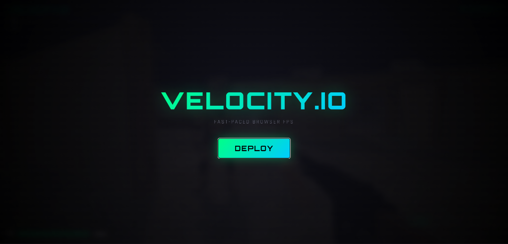
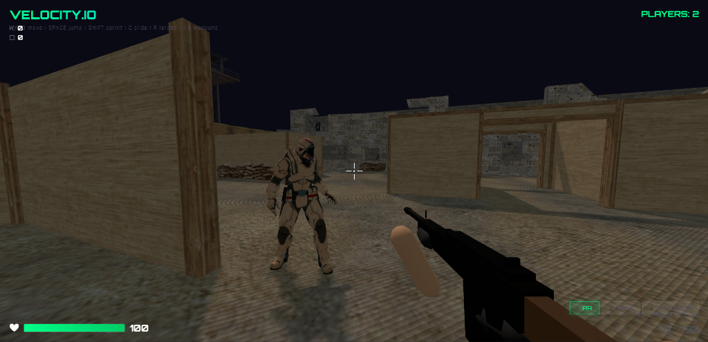
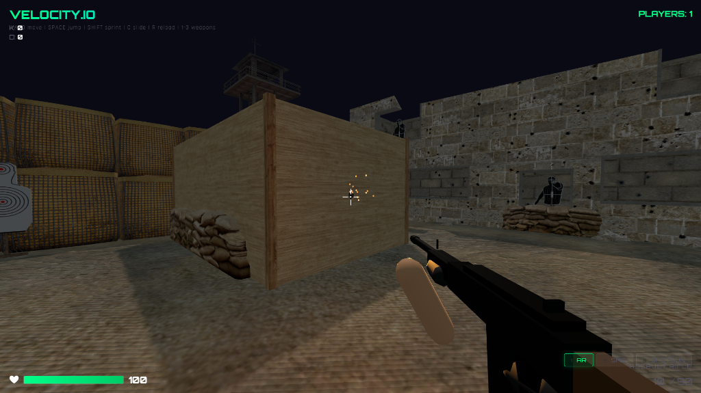
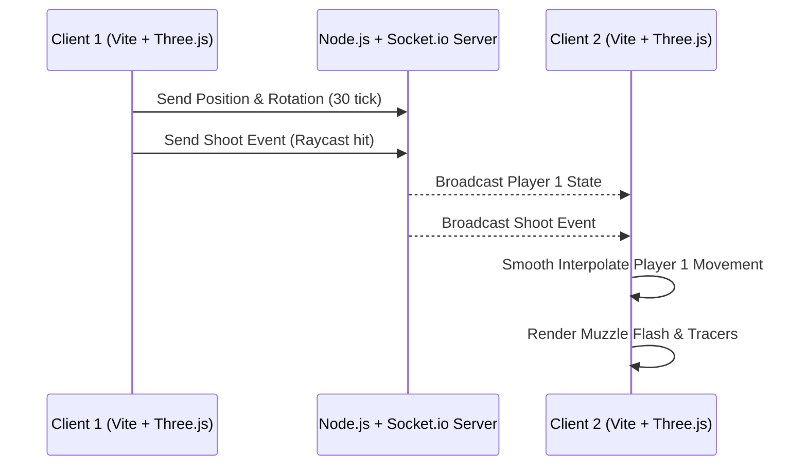

<div align="center">

# 🔫 Velocity.io
**High-Performance Multiplayer Browser FPS**

[](https://threejs.org/)
[](https://socket.io/)
[](https://vitejs.dev/)
[](https://nodejs.org/)

Velocity.io is a fast-paced, competitive multiplayer first-person shooter built entirely for the browser. It leverages the raw power of **Three.js** for rendering, **Rapier3D** for pixel-perfect physics, and **Socket.io** for real-time multiplayer synchronization.

</div>

---

## 🎮 Gameplay Preview

<div align="center">
  
  <br><br>
  
  
</div>

---

## ✨ Core Features

- 🏃‍♂️ **Kinematic Character Controller**: Pixel-perfect collision detection, stair-stepping, and momentum-based slide-hopping mechanics.
- 🔫 **Procedural Weapon Mechanics**: Dynamic weapon bobbing, swaying, recoil kicks, and Aim-Down-Sights (ADS).
- 🌐 **Real-time Multiplayer**: Powered by Socket.io with smooth client-side interpolation and dynamically loaded GLB player models.
- 🗺️ **Triangle-Level Map Collision**: Parses 3D `.glb` arenas to construct exact physical hitboxes for floors, ramps, and walls.

---

## 🏗️ Multiplayer Architecture



---

## 🚀 Quick Start

Get the game running locally in seconds.

### 1. Install Dependencies
```bash
npm install
```

### 2. Run the Game Client
```bash
npm run dev
```

### 3. Start the Multiplayer Server
*(Open a separate terminal window)*
```bash
node server.js
```

Open your browser to `http://localhost:5173` (or the port Vite provides) and start shooting!

---

## 💻 Technologies Used

| Domain | Technology |
| :--- | :--- |
| **Frontend Renderer** | Vite, Three.js, GLTFLoader |
| **Physics Engine** | `@dimforge/rapier3d-compat` |
| **Backend Server** | Node.js, Express |
| **Networking** | Socket.io |

---

## 📜 License

This project is licensed under the **MIT License**.


---
<div align="center">
  
</div>
